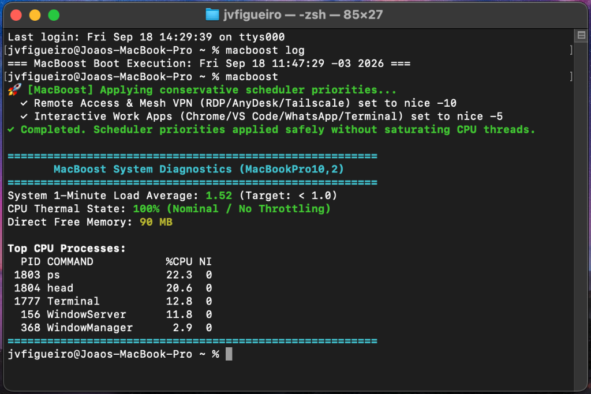

# Legacy Mac Boost: Optimization script for MacBookPro10,2

Target Platform: macOS 15 Sequoia via OpenCore Legacy Patcher (OCLP)  
Target Hardware: MacBook Pro 13" Retina (Late 2012 / Early 2013 - MacBookPro10,2)  
Specifications: Intel Core i5-3210M (Ivy Bridge 2C/4T @ 2.5-3.1 GHz), 8 GB DDR3L RAM, Intel HD Graphics 4000, 2560x1600 Retina Display  



---

## Disclaimer

This software is provided "AS IS", without warranty of any kind. Modifying system daemons, kernel tunables, power management settings, and security layers carries inherent risks. The author assumes no liability for data loss, system instability, or unintended behavior. Use entirely at your own risk.

---

## Attribution and Acknowledgements

This project is directly inspired by and builds upon the research, testing, and methodology shared by Reddit user **TeckFire** for optimizing 2012 Retina MacBook Pros running modern macOS releases:

* Reference Resource: [TeckFire's Configuration & Scripts (Pastebin)](https://pastebin.com/UY2012cH)

While TeckFire's original work targeted a 15" quad-core Core i7 model with 16 GB of RAM, dedicated NVIDIA GPU, and active continuous background polling scripts, **Legacy Mac Boost** refactors those concepts specifically for the 13" dual-core Core i5 model. Key architectural adaptations include:
* Eliminating continuous polling loops in favor of a zero-overhead one-shot boot injector.
* Sizing network and virtual memory structures strictly for an 8 GB RAM constraint.
* Implementing granular runtime sysctl validation with logging.
* Using conservative scheduler renice values (-10 / -5) to prevent thread starvation on a 2C/4T CPU.
* Preserving App Store, Apple ID 2FA verification, and AirDrop while disabling heavy background AI, telemetry, and indexing services.
* Leaving native macOS user interface effects and animations untouched.

---

## Intended Operational Environment

Legacy Mac Boost is designed specifically for **controlled, secure networking environments**. It is tailored for machines functioning primarily as thin clients, remote administration workstations (RDP, SSH, AnyDesk), and light browsing terminals where all internet traffic is routed through a monitored, pre-filtered private VPN (such as Tailscale or an internal WireGuard/IPsec gateway).

---

## Core Design Principles & What the Suite Does

Legacy Mac Boost executes a focused, non-invasive optimization pipeline organized into five clear phases:

### 1. App Store & Apple ID AuthKit 100% Preserved
* **Preserved Services:** The Apple ID authentication daemon (`com.apple.akd`), App Store catalog and purchase engine (`com.apple.amsaccountsd`), and Apple Media Services engagement daemon (`com.apple.amsengagementd`) remain active and untouched.
* **Why This Matters:** Disabling AuthKit breaks 2-Factor Authentication (2FA) verification codes, iCloud login validation, and native App Store updates. Legacy Mac Boost ensures you can seamlessly sign into Apple services and download or update apps without friction.

### 2. Local Networking & AirDrop Preserved
* **Preserved Services:** `sharingd` and `rapportd` remain enabled.
* **Functionality:** Local peer-to-peer Wi-Fi transfers, AirDrop discovery, and continuity handoff work out of the box.

### 3. Native UI Fidelity (Zero Visual Overrides)
* **Untouched Aesthetics:** The script applies **zero** forced modifications to native macOS window animations, dock motion, blur effects, or transparency.
* **User Control:** Users retain standard system appearance controls in macOS System Settings without script interference.

### 4. Targeted Background Daemon Silencing
The script unloads resource-heavy background processes that cause frequent CPU spikes on dual-core Ivy Bridge processors:
* **Spotlight Indexing:** Indexing is disabled on all volumes via `mdutil -a -i off` and `mdutil -a -d`, alongside unloading `com.apple.metadata.mds*` and GUI knowledge agents (`com.apple.spotlightknowledged*`).
* **Siri & Apple Intelligence:** Daemons such as `intelligenceplatformd`, `triald`, `suggestd`, `siriknowledged`, `siriinferenced`, `corespeechd`, `assistantd`, `duetexpertd`, `coreduetd`, and `contextstored` are unloaded.
* **Touch Bar Server:** `com.apple.touchbarserver` is disabled (MacBookPro10,2 hardware does not possess a Touch Bar).
* **Crash Reporting & Telemetry:** `analyticsd`, `symptomsd`, `spindump`, `tailspind`, `biomed`, `biomesyncd`, `powerlogHelperd`, and `ReportCrash` are disabled.
* **Photo & Media Analysis:** `photoanalysisd` and `mediaanalysisd` background AI scanning daemons are unloaded.
* **Unsupported Hardware Subsystems:** `aned`, `aneuserd`, `nfcd`, and Sidecar display daemons (`sidecardisplayagent`, `sidecarrelay`) are deactivated.

### 5. Configurable Gatekeeper Security Policy
* **Interactive Option:** On execution, `optimize.sh` presents a prompt to choose whether to disable Gatekeeper or keep it active.
* **Non-Interactive Flags:**
  * `--keep-gatekeeper`: Keeps Gatekeeper (`spctl --master-enable`) and `LSQuarantine` active.
  * `--disable-gatekeeper`: Disables Gatekeeper (`spctl --master-disable`) and bypasses quarantine verification (`LSQuarantine=false`) for faster application launches in secure environments.

### 6. Power Management & Strict Power Nap Elimination
* **Strict Power Nap & DarkWake Suppression:** Executes `pmset -a powernap 0`, `pmset -b powernap 0`, and `pmset -c powernap 0`, while purging all scheduled daemon wake alarms via `pmset schedule cancelall`.
* **Battery TCP Keepalive Policy:** On battery power (`pmset -b tcpkeepalive 0`), the network stack ceases Bonjour Sleep Proxy periodic heartbeats and push notification timers that wake the CPU every 30 to 60 minutes with the lid closed. When connected to AC power, TCP keepalive is maintained (`pmset -c tcpkeepalive 1`).
* **Safe Sleep (`hibernatemode 3`):** Keeps RAM energized during normal sleep for instant sub-second wake times, while retaining `/var/vm/sleepimage` to prevent data loss if the battery is fully depleted.
* **Standby & Autopoweroff:** Standby delays are configured to 3 hours on low battery (`standbydelaylow 10800`), 6 hours on healthy battery (`standbydelayhigh 21600`), and 8 hours for autopoweroff (`autopoweroffdelay 28800`). Wake-on-LAN (`womp 0`) and proximity wake (`proximitywake 0`) are disabled.

### 7. Zero-Overhead Persistence (One-Shot Boot Injector)
* **Architecture:** Unlike tools that run continuous polling loops in the background, Legacy Mac Boost uses a one-shot LaunchDaemon (`/Library/LaunchDaemons/com.legacy.macboost.plist`) that triggers `/usr/local/bin/macboost_boot.sh` once at boot (`RunAtLoad=true`, `KeepAlive=false`) and exits (`exit 0`). It consumes 0.00% CPU during normal daily operation.
* **Granular Sysctl Validation:** Probes the kernel Management Information Base (MIB) before writing each parameter, logging `[OK]`, `[SKIP]`, or `[FAIL]` to `/var/log/macboost_boot.log`.
* **8 GB RAM Tunables:** Tunes virtual memory thresholds, vnodes (`kern.maxvnodes=262144`), open files (`kern.maxfiles=262144`), timer coalescing scale, and TCP buffer ceilings (8 MB).
* **Logging Overhead Reduction:** Disables verbose system disk logging (`log config --mode "level:off"`), silencing write amplification on SATA SSDs.

### 8. CLI Management Tool (`macboost` / `optimizemac`)
A unified command-line tool is installed at `/usr/local/bin/macboost` (aliased to `/usr/local/bin/optimizemac`):
* **`macboost`**: Applies scheduler nice priorities to running target applications and displays real-time diagnostics.
* **`macboost boost`**: Re-applies conservative scheduler priorities on demand:
  * **Tier 1 (`nice -10`):** Windows App (RDP), AnyDesk, Tailscale (prioritizes remote frame rendering and VPN packets).
  * **Tier 2 (`nice -5`):** Google Chrome, VS Code, WhatsApp, Terminal, iTerm2 (elevates interactive user tools without starving `WindowServer` or `hidd` input drivers on a 2C/4T CPU).
* **`macboost status`**: Displays system 1-minute load average, CPU thermal throttling state (`pmset -g therm`), direct free memory (`vm.page_free_count`), and top active CPU processes.
* **`macboost log`**: Displays the exact sysctl validation boot log (`/var/log/macboost_boot.log`).

---

## Installation, Usage, and Uninstallation

### Running the Optimization Script

1. Make the script executable:
   ```bash
   chmod +x optimize.sh
   ```

2. Run the script as root:
   ```bash
   sudo ./optimize.sh
   ```
   *Optional non-interactive flags:*
   ```bash
   sudo ./optimize.sh --keep-gatekeeper
   # or
   sudo ./optimize.sh --disable-gatekeeper
   ```

3. **Reboot your Mac** to flush lingering background services from memory and allow the one-shot boot daemon to apply validated kernel tunables:
   ```bash
   sudo reboot
   ```

### Daily Usage via CLI

Check status or boost applications at any time:
```bash
# Apply app scheduling priorities and display system diagnostics:
macboost

# Re-apply app priorities only:
macboost boost

# View real-time load average, thermal state, and top processes:
macboost status

# View boot-time kernel parameter injection log:
macboost log
```

### Complete Uninstallation (`uninstall.sh`)

Legacy Mac Boost provides a dedicated 1-to-1 symmetric uninstallation script that restores macOS to its default state:

1. Run the uninstaller as root:
   ```bash
   sudo ./uninstall.sh
   ```

2. What `uninstall.sh` does:
   * Removes `/Library/LaunchDaemons/com.legacy.macboost.plist`, `/usr/local/bin/macboost_boot.sh`, `/usr/local/bin/macboost`, and `/var/log/macboost_boot.log`.
   * Re-enables all 30 system services and 36 user services in `launchd`.
   * Re-enables Spotlight indexing (`mdutil -a -i on`).
   * Re-enables Gatekeeper (`spctl --master-enable`) and `LSQuarantine`.
   * Restores default macOS power management configuration (`powernap 1`, `tcpkeepalive 1`, `womp 1`, `proximitywake 1`).

3. **Reboot your Mac** to reload services and kernel defaults:
   ```bash
   sudo reboot
   ```

---

## OpenCore Legacy Patcher Boot-Args (Optional)

In your OpenCore `config.plist`, the following boot arguments may be utilized to further reduce kernel overhead by disabling legacy hardware mitigations in a controlled environment:

```xml
<dict>
    <key>boot-args</key>
    <string>keepsyms=1 debug=0x100 -lilubetaall ipc_control_port_options=0 -nokcmismatchpanic amfi=0x80 vm_compressor_mode=1 ncl=131072 amfi_get_out_of_my_way=1 kpti=0 alcid=1 spectre=0 mds=0 l1tf=0 mitigations=0 cwae=0 apple-panic-no-check=1 no_vhentropy=1 darkwake=0 -no_auto_rebuild</string>
    <key>csr-active-config</key>
    <data>fwg=</data>
</dict>
```
